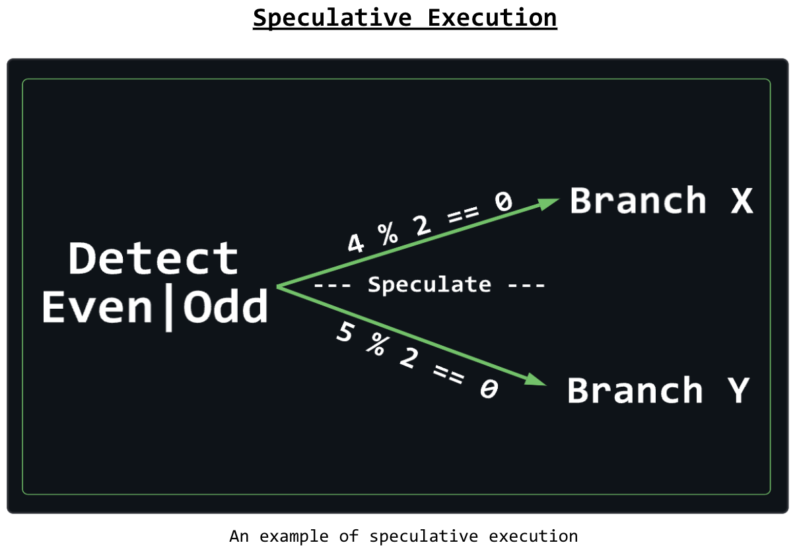
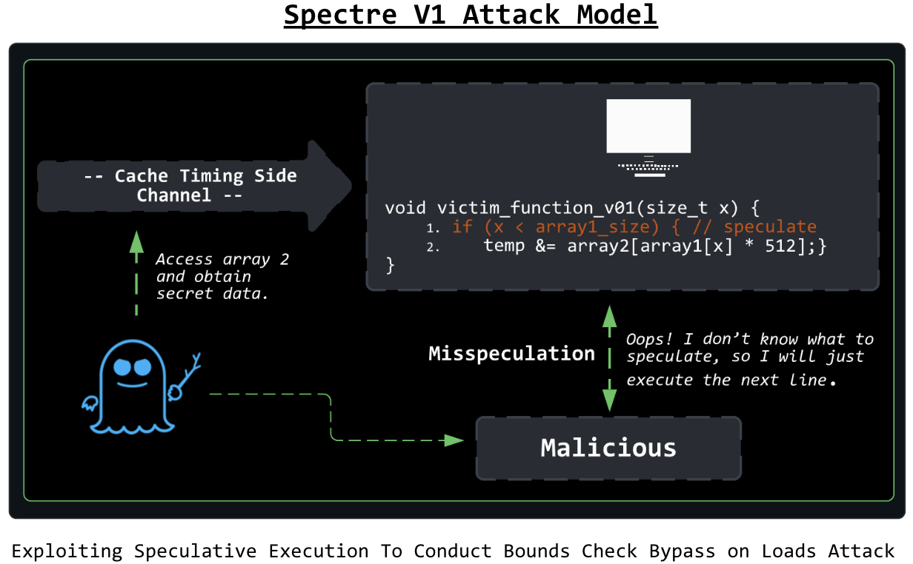
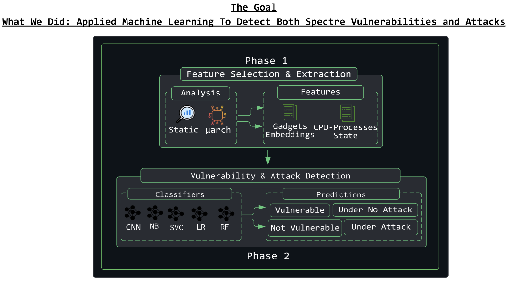
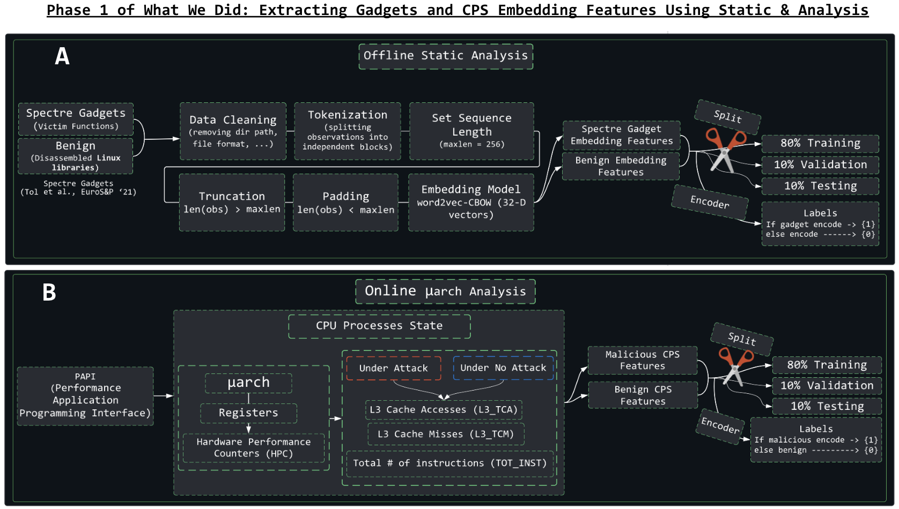
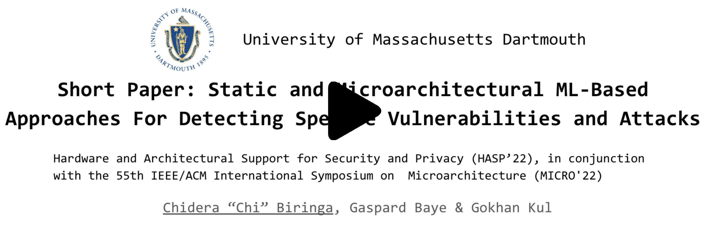

<h2 align = "center"> SPECDET </h2>

Official Implementation of [Short Paper: Static and Microarchitectural ML-Based Approaches for Detecting Spectre Vulnerabilities and Attacks](https://arxiv.org/abs/2210.14452#). Hardware and Architectural Support for Security and Privacy (HASP’22) in Conjunction With The 55th IEEE/ACM International Symposium on Microarchitecture (MICRO’22).

<h2 align = "center"> Visual Depiction of Research </h2>

```Problem``` 

<p float="left", align = "center">
  
  
</p>

```Solution```

<p float="left", align = "center">
  
  
</p>

<!-- <p align="center">  </p> -->


### Abstract
> Spectre intrusions exploit speculative execution design vulnerabilities in modern processors. The attacks violate the principles of isolation in programs to gain unauthorized private user information. Current state-of-the-art detection techniques utilize micro-architectural features or vulnerable speculative code to detect these threats. However, these techniques are insufficient as Spectre attacks have proven to be more stealthy with recently discovered variants that bypass current mitigation mechanisms. Side-channels generate distinct patterns in processor cache, and sensitive information leakage is dependent on source code vulnerable to Spectre attacks, where an adversary uses these vulnerabilities, such as branch prediction, which causes a data breach. Previous studies predominantly approach the detection of Spectre attacks using the microarchitectural analysis, a reactive approach. Hence, in this paper, we present the first comprehensive evaluation of static and microarchitectural analysis-assisted machine learning approaches to detect Spectre vulnerable code snippets (preventive) and Spectre attacks (reactive). We evaluate the performance trade-offs in employing classifiers for detecting Spectre vulnerabilities and attacks.

<!-- ### To cite
```
@inproceedings{
	ACM BibTex coming soon...
}
``` -->
In the current absence of ACM, cite arxiv
```
@article{biringa2022short,
  title={Short Paper: Static and Microarchitectural ML-Based Approaches For Detecting Spectre Vulnerabilities and Attacks},
  author={Biringa, Chidera and Baye, Gaspard and Kul, G{\"o}khan},
  journal={arXiv preprint arXiv:2210.14452},
  year={2022}
}
```

### Installation
```
$ git clone https://github.com/biringaChi/SPECDET
$ cd specdet
$ pip install -r requirements.txt
```
### Gadget Data
Refer: [Gadgets](https://github.com/biringaChi/SPECDET/tree/main/datasets/spectre_gadgets)

### CPU-PS Data
Refer: [CPU-PS](https://github.com/biringaChi/SPECDET/tree/main/datasets/cpu_processes)

### Generating Spectre Embeddings
```
$ cd src/SGDetector/
$ python spectre_embed.py
```

#### Train & Test Vulnerability Detector
```
$ cd src/SGDetector/
$ python train.py --epochs=<arg> --lr=<arg> --batch_size=<arg>
```
#### Evaluate
```
$ cd src/SGDetector/
$ python test.py
```

### Train & Test Attack Detector
```
$ cd src/CPSDetector/
$ python train.py
```

### Presentation Video
[](https://www.youtube.com/watch?v=bUBxGskDaOY "")

### Acknowledgments
This work has been funded by UMass Dartmouth Cybersecurity Center. Usual disclaimers apply.

### LICENSE
[MIT LICENSE](./LICENSE).